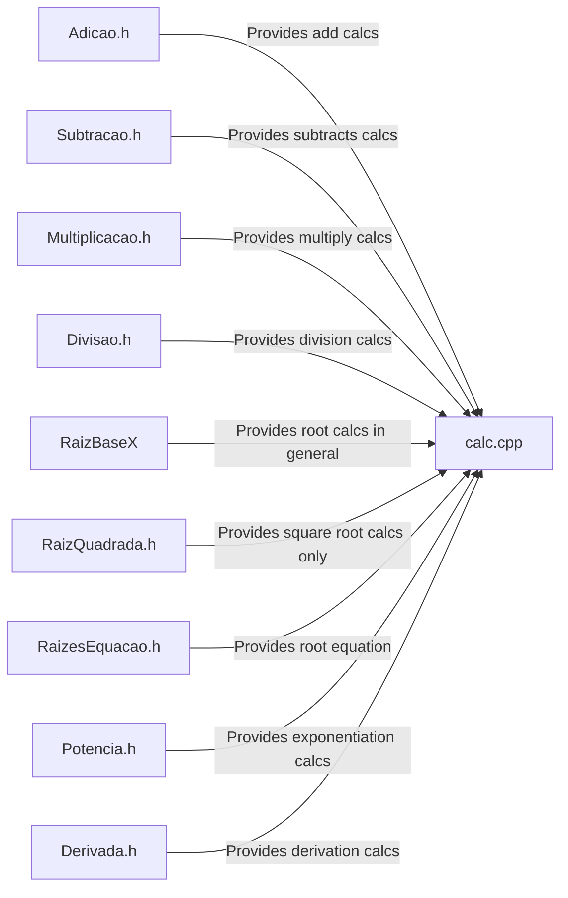

# CalCpp - A simple CLI scientific calculator in C++

  
  
  
  
  
  
  

###

  
Work In Progress (click to expand)

  
#### Basics Operations

 - [x] Add
 - [x] Subtract
 - [x] Multiply
 - [x] Divide
 #### Algebra
 - [x] Exponentiation
 - [x] Square root
 - [x] Root calc in general
 - [x] Root equation
#### Calculus
 - [ ] Limits
 - [x] Derivation
 - [ ] Integral
	 - [ ]  Improper integrals
	 - [ ]  Multiple integration
	 - [ ]  Line integrals and surface integrals
	 - [ ]  Contour integrals
	 - [ ]  Integrals of differential forms
	 - [ ]  Summations
	 - [ ]  Functional integrals
  

###
 

## About the project
This is an opensource scientific calculator made from scratch by me :)
Feel free to fork or contribute with this project

## Code diagram

For now, that code is pretty simple  😅

